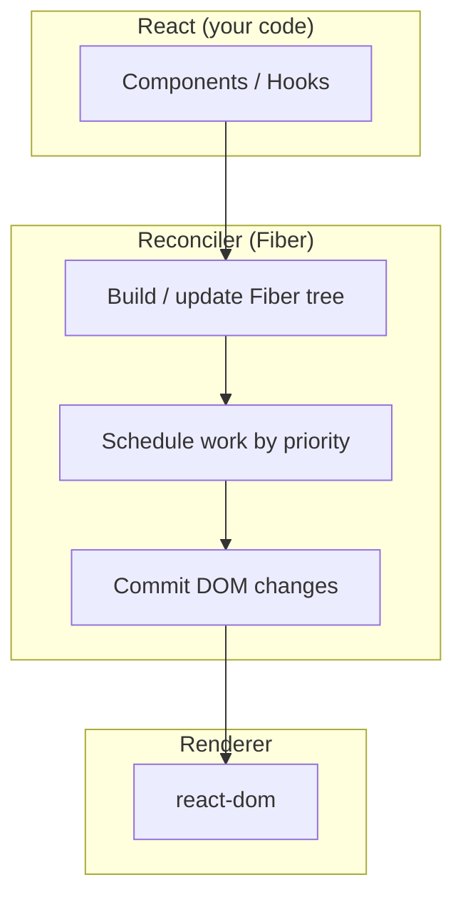
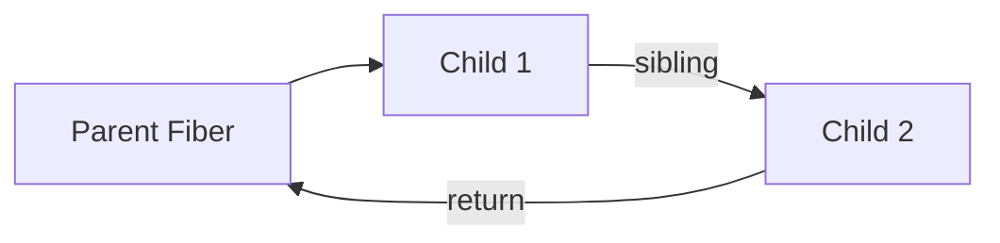
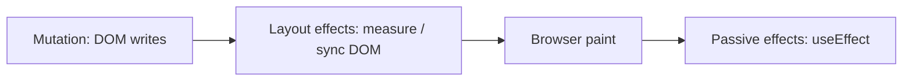
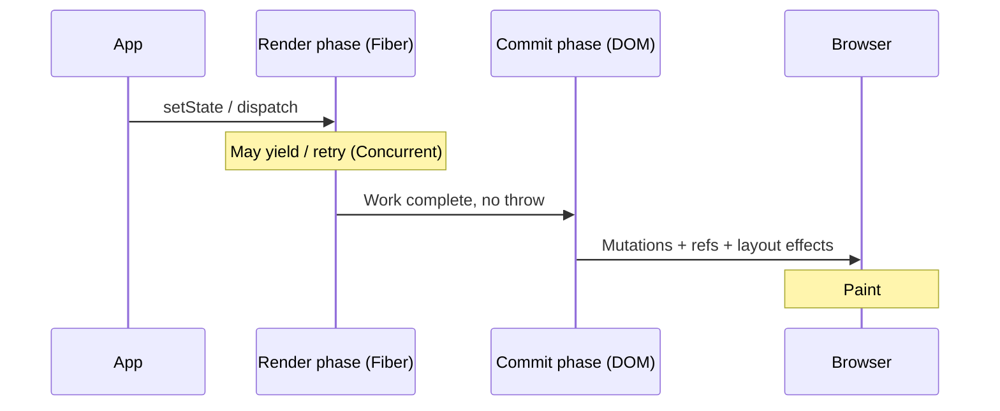

# React Fiber & Reconciliation - Interview Q&A (React 19 vs earlier)

A study guide for **React Fiber**, the **reconciliation** algorithm, and how **React 19** fits next to **React 16 to 18**. Diagrams use [Mermaid](https://mermaid.js.org/) so they render as figures on GitHub, GitLab, and many IDEs.

---

## Quick visual: where Fiber sits

---

## Core terms (one minute)

| Term | Meaning |
|------|---------|
| **Fiber** | A plain JS object representing a *unit of work* for one component instance; fibers form a **linked tree** (child, sibling, return) so work can be **paused, resumed, and discarded**. |
| **Reconciliation** | Comparing the **new** element tree to the **current** Fiber tree and deciding **updates, placement, or deletion** - without always touching the DOM immediately. |
| **Render phase** | Pure: build the work-in-progress tree, may be **interrupted** or **thrown away** (Concurrent Mode). |
| **Commit phase** | **Not** interruptible: apply DOM mutations, run layout effects, then paint-related work. |

---

## Interview questions & answers

### 1. What problem did Fiber solve that the old stack reconciler could not?

**Answer:** Before Fiber (React 15 and earlier), reconciliation was **recursive** and **synchronous**. Once React started updating a subtree, it **had to finish** before returning control to the browser - so large updates could **block the main thread**, causing jank.

Fiber **breaks work into small units** linked in a tree. The scheduler can **yield** after a unit, run higher-priority work (e.g. input), then **resume**. That enables **Concurrent Features** (time-slicing, Suspense boundaries, interruptible renders) and a clearer split between **render** (may abort) and **commit** (must complete).

**React 19:** Same Fiber model; the ecosystem emphasis shifts toward **predictable concurrent patterns** (e.g. `useTransition`, Actions) and optional **React Compiler** for memoization - but the **pause / resume / priority** story is still Fiber-driven.

---

### 2. What is a Fiber node, structurally?

**Answer:** A Fiber is roughly a record with:

- **Identity:** `type`, `key`, `pendingProps` / `memoizedProps`, `stateNode` (DOM node or class instance, etc.).
- **Tree links:** `child`, `sibling`, `return` - a **linked list** of siblings under a parent instead of only nested arrays.
- **Work flags:** what side-effects are needed (placement, update, deletion, ref, etc.).
- **Lanes / priorities** (conceptually): which batch of updates this work belongs to.

This structure lets React **walk the tree incrementally** without deep synchronous recursion.

---

### 3. Explain the reconciliation algorithm at a high level.

**Answer:**

1. **Trigger:** state update, parent re-render, or concurrent lane processed.
2. **Render phase:** Starting from a root, React walks fibers, **reuses** compatible fibers when `type` + `key` match, **creates** new fibers for new types/keys, and **marks** deletions. It computes a **work-in-progress** tree.
3. **Diffing heuristics (simplified):** Same position + same `type` → **update** in place. Different `type` → **unmount** old subtree, **mount** new. Lists need **stable `key`** so React can reorder without destroying identity.
4. **Commit phase:** Apply DOM updates, refs, and **passive** / **layout** effects in defined order.

**React 19:** Same overall phases. Newer APIs (e.g. **ref as a prop** on function components, **ref cleanup** functions) change *how* you express refs in user code, not the fundamental reconcile → commit pipeline.

---

### 4. Why are `key`s important for lists?

**Answer:** `key` tells React **which logical item** is which across renders. Without stable keys, React may **reuse the wrong fiber** for a sibling, causing **incorrect state**, unnecessary remounts, or broken animations.

Fiber’s sibling traversal makes **keyed reconciliation** the mechanism that preserves identity when items **reorder**, **insert**, or **remove**.

---

### 5. What is the difference between the render phase and the commit phase?

**Answer:**

| Phase | Interruptible? | Side effects on DOM? |
|-------|----------------|----------------------|
| **Render** | Yes (Concurrent) | No - should be pure |
| **Commit** | No | Yes - mutations, refs, layout |

**Why it matters in interviews:** `useLayoutEffect` runs **after DOM mutations** but **before paint**; `useEffect` runs **after paint**. Both run in **commit** (or the flush after it), not during arbitrary render-phase work.

---

### 6. How does Concurrent Rendering relate to Fiber?

**Answer:** Concurrent rendering is **implemented by** scheduling Fiber work in **chunks**. High-priority updates (e.g. typing) can **preempt** a low-priority update (e.g. heavy list filter behind `startTransition` / `useTransition`).

**React 18:** `createRoot` enables concurrent features by default for updates that opt in (e.g. transitions).

**React 19:** **Actions** (`useActionState`, form `action` props) formalize async transitions; **`use`** suspends on promises/context. Still: **Fiber + scheduler** decide when work runs.

---

### 7. Compare React 16, 17, 18, and 19 from a Fiber / reconciliation angle.

**Answer (concise):**

| Aspect | React 16 | React 17 | React 18 | React 19 |
|--------|----------|----------|----------|----------|
| **Fiber** | Introduced; async mode experimental | Fiber stable; gradual upgrades | **Concurrent root** default with `createRoot`; automatic batching | Same engine; **compiler** story; **Actions**, **`use`**, **document metadata** |
| **Legacy root** | `ReactDOM.render` | Same | Deprecated path vs `createRoot` | **`ReactDOM.render` removed** - must use `createRoot` |
| **Batching** | Event-handler batching | Same | **More automatic batching** (e.g. promises, timeouts) | Continues |
| **Interruptible render** | Behind unstable APIs / flags | Refinement | `useTransition`, `Suspense`, streaming SSR patterns | Richer patterns (Actions, `use`); internal perf work |
| **Refs on function components** | `forwardRef` typical | Same | Same | **`ref` as prop** - `forwardRef` less necessary for new code |

**Interview sound bite:** *“Fiber landed in 16; 18 made concurrent the default mental model for roots; 19 doubles down on primitives built on that same reconciler.”*

---

### 8. What is double buffering in React’s Fiber implementation?

**Answer:** React maintains a **current** tree (what’s on screen) and a **work-in-progress** tree. During render, it builds/alters WIP; on successful commit, pointers swap and WIP becomes **current**. If render aborts, **current** is untouched - no partial DOM updates from that attempt.

---

### 9. Does the Virtual DOM still exist with Fiber?

**Answer:** “Virtual DOM” usually means **the lightweight description of UI** (elements). Fiber is **the internal tree of work units** used to reconcile that description with the last committed UI. They’re complementary: **elements** are the input; **fibers** are how React **schedules and diffs** efficiently.

---

### 10. How do error boundaries interact with Fiber?

**Answer:** Error boundaries are **class components** (or future equivalents) that catch errors **during render** in descendants. Fiber tracks which boundary should handle an error and can **roll back** to a consistent tree state and **commit** fallback UI instead of crashing the whole root.

---

### 11. What is time slicing?

**Answer:** Splitting render work into **small slices** so the main thread can **respond to input** between slices. Implemented via Fiber’s incremental traversal + scheduler priorities - not a separate “mode” you toggle in app code, but the **effect** of concurrent scheduling.

---

### 12. React 19: What are “Actions” and why do they matter for rendering?

**Answer:** **Actions** bundle intent (e.g. form submission) with **transition semantics** so React can keep the UI responsive and coordinate **pending** states. From a Fiber perspective, they encourage updates that are **explicitly non-urgent**, which maps cleanly to **transition lanes** and **interruptible** work - the same machinery as `useTransition`.

---

### 13. React 19: `use()` - how does it tie to Suspense and Fiber?

**Answer:** `use()` lets a component **read a Promise or Context** during render. If the resource isn’t ready, React **throws to the nearest Suspense boundary** - the Fiber tree records **where to suspend** and the scheduler can **show fallback** without committing the suspended subtree’s incomplete UI. This is the same **Suspense mechanism** refined over 18 → 19 with a unified hook.

---

### 14. How would you explain “lanes” in an interview without reading the source?

**Answer:** **Lanes** are an internal **bitfield** model for grouping and prioritizing updates (e.g. sync default updates vs transitions vs retries). You rarely name “lanes” in app code, but you **feel** them when you use **`useTransition`**, **`startTransition`**, or **Actions** - those updates get **lower priority** than e.g. discrete input.

---

### 15. Common trap: why can’t you use `useLayoutEffect` on the server?

**Answer:** There is **no DOM** and **no paint** on the server. `useLayoutEffect` runs in the **commit** phase around DOM timing; SSR **has no commit** in that sense. React warns and expects `useEffect` or server-safe patterns instead.

---

## Senior / staff: React engine (reconciler, scheduler, renderer)

These topics show up in **staff frontend**, **performance**, and **framework internals** loops. Stay at the **behavior + tradeoff** level unless the interview explicitly goes into C++ scheduler or Fiber struct fields.

---

### 16. What are the **sub-phases** of commit, and why does React split them?

**Answer:** After a successful render, commit is **not** one monolithic “touch the DOM” step. Conceptually (names vary slightly by version):

1. **Before mutation** - last chance for work that must happen before DOM writes (rare in app code; more internal).
2. **Mutation** - DOM updates: insert/remove/reorder nodes, update attributes/text, **detach old refs** where needed.
3. **Layout** - `useLayoutEffect` / `componentDidUpdate`-style reads: browser has applied mutations but **paint may not have happened yet** - safe to measure layout and synchronously update DOM before users see pixels.
4. **Paint** (browser) - then **passive** phase: `useEffect` flushes after paint (async-ish scheduling).

**Why interviews care:** ordering bugs (measure in `useEffect` → flicker) are explained by **mutation → layout → paint → passive**, not by “React is random.”

---

### 17. Why does `useInsertionEffect` exist - how is it different from `useLayoutEffect`?

**Answer:** `useInsertionEffect` fires **before** `useLayoutEffect`, still **after** DOM mutations but **before** other components’ layout effects run in the same commit. It exists so **CSS-in-JS runtime** (or any style injection) can insert rules **before** layout effects read styles/computed layout - avoiding **tearing** or inconsistent measurements.

**Senior angle:** it’s a **commit-order** primitive tied to **real-world constraints** of concurrent rendering + style injection, not “another `useEffect`.”

---

### 18. What is a **render bailout**, and how is it different from “skipping reconciliation”?

**Answer:**

- **`React.memo` / `PureComponent` / `shouldComponentUpdate` returning `false`:** React can **skip calling** the component function (or class render) for that fiber **if** props/state/context inputs are unchanged per the comparison.
- **Child memoization when parent re-renders:** If a child bails out, React avoids **descending** into that subtree’s render path - a major CPU win.

**Nuance:** A bailout is about **whether your component function runs**. Parent updates can still **traverse** nearby fibers depending on the update root and context propagation. **Context changes** re-render all **consuming** descendants unless they split context or use selectors/patterns to narrow churn.

**React Compiler (optional):** can automate memoization so fewer manual `useMemo`/`useCallback`/`memo` - behavior still has to respect the same **referential stability** story the engine relies on.

---

### 19. How does **automatic batching** interact with the scheduler and microtasks?

**Answer:** In modern React, multiple `setState` calls in the same **event tick** (and, since 18, in many **async** continuations like `setTimeout`, promises, native handlers depending on version) can be **coalesced** into fewer renders. Implementation-wise, updates are often **queued** and flushed in a **microtask**-friendly way so the tree isn’t committed repeatedly for redundant work.

**Senior trap:** `flushSync` **opts out** of async scheduling for wrapped updates - it forces **synchronous** render+commit up to the flush boundary (escape hatch; can hurt concurrent features).

---

### 20. Explain **hydration** from the engine’s point of view - not the “tutorial” version.

**Answer:** The server shipped **HTML**. The client builds a **Fiber tree** and must **attach** `stateNode`s to **existing** DOM nodes instead of recreating them. The client reconciler **walks** the DOM and the expected element tree together; mismatches produce **recoverable errors** (warnings, attribute fixes) or **hard failures** depending on severity.

**Senior topics:**

- **Suspense + streaming SSR:** the client may **hydrate in chunks**; priorities decide which subtrees hydrate first (**selective / progressive hydration** patterns).
- **Hydration mismatch:** often means **server tree ≠ first client render** - not “React broke,” but **non-determinism** (dates, `Math.random`, `window`, `Date.now()` in render), **bad keys**, or **external DOM mutation**.

**React 19:** more emphasis on **diagnostics** and **root options** around errors during render/hydration (e.g. `onCaughtError` / `onUncaughtError` on roots) - still the same **match DOM → commit attach** core idea.

---

### 21. Where does **React Server Components (RSC)** sit relative to Fiber on the client?

**Answer:** RSC introduces a **server-driven tree serialization** (“Flight”) and a **different render entry** for server components. On the client, **Client Components** still reconcile through **Fiber** when they update.

**Staff framing:** two cooperating systems - **server reference graph + streaming payload** and **client Fiber reconciler** - joined at **client boundaries**. Client engine questions usually focus on **boundaries**, **caching**, **serialization constraints** (no hooks that imply client-only timing), and **waterfalls** across server/client, not “Fiber replaced RSC.”

---

### 22. What does **Strict Mode** do in development that surfaces engine semantics?

**Answer:** Strict Mode intentionally **double-invokes** certain lifecycles in dev (e.g. render, some effect setups/teardowns) to expose **impure render** and **missing cleanup**. It does **not** mean production runs twice.

**Senior takeaway:** effects must be **idempotent in setup assumptions** and **fully cleaned up** - because concurrent rendering can **discard** render attempts before commit, and dev Strict Mode amplifies that story.

---

### 23. How can **low-priority (transition) work starve** or feel “stuck,” and what do you do?

**Answer:** If every update is wrapped in `startTransition` / `useTransition`, or if you keep enqueueing transitions while high-priority work never runs, UI can feel unresponsive. The engine tries to **interleave** urgent work, but **your architecture** still matters: split state, **deferred values** (`useDeferredValue`), **throttling**, **virtualization**, **moving work off-main-thread** (worker, WASM), or **smaller update roots** (multiple roots rarely; more often **better state colocation**).

**Interview move:** name **starvation** as a scheduling pathology and list **instrumentation** (React Profiler, Long Tasks, `performance.mark`) - not just “useTransition fixes all jank.”

---

### 24. Suspense **boundaries** and **list** semantics - what breaks juniors?

**Answer:** A thrown promise during render is handled by the **nearest** Suspense boundary **above** the throwing fiber. Nested boundaries let you **scope** fallbacks and avoid **whole-app** skeletons.

**Suspense for data** still requires a **cacheable read** model (throw promise / `use` / library integration). **Ordering** with transitions determines whether you see **pending** UI or **stale** UI - that’s **intentional** concurrent UX, not a bug.

---

### 25. Why did React change **event delegation** in React 17+ (`react-dom`), and does Fiber “own” events?

**Answer:** React 17+ attaches listeners to the **root container** rather than `document` for many event types - better for **multiple React roots**, **micro-frontends**, and **gradual adoption**. **Fiber does not implement events**; **`react-dom`** does. Keeping that separation straight is a **senior** signal: reconciler vs renderer responsibilities.

---

### 26. What is **offscreen** / **hidden** rendering, and why do teams care?

**Answer:** Patterns that **prepare** UI the user cannot see yet (prefetch, keep-alive tabs) interact with **priority** and **deferred** commits. APIs in this space have evolved (`Offscreen`, experimental **`<Activity />`** in newer channels - names/availability change).

**Safe interview answer:** “React can **do work** at lower priority or keep subtrees **alive** to preserve state, but the exact public API surface moves - I’d verify the current docs for the version we ship.”

---

### 27. How do **refs** participate in commit (especially cleanup in React 19)?

**Answer:** Refs are **not** updated during render for DOM refs in the way beginners imagine; **ref assignment** happens around **commit** when the **instance** exists or changes. **React 19** adds **ref cleanup functions** (mirroring effect cleanup) so ref-like resources can be released when elements unmount or ref identity changes - still **commit-ordered**, tied to **mutation/layout** timing rules.

---

### 28. What would you **profile** first to prove the engine is the bottleneck vs app code?

**Answer:** Distinguish:

- **Render time** (JS in component bodies, huge lists, expensive memo comparisons).
- **Commit time** (giant DOM mutations, layout thrash from interleaved read/write).
- **Passive effects** (heavy `useEffect` work blocking next paint indirectly).

Use **React Profiler** (commit flame + “why did this render?” when available), **Chrome Performance**, **Layout Shift** / **Long Task** signals, and **interaction instrumentation** (`INP`). **Senior** candidates propose a **hypothesis tree** before micro-optimizing `memo`.

---

### 29. What is **eager state** / **transitions** vs **urgent updates** in user-land terms?

**Answer:** Urgent updates map to **higher scheduler priority** (typing, clicks you model as urgent). Transitions mark updates as **interruptible** and **deprioritized** relative to urgent input.

**Staff follow-up:** transitions are **not** “debounce” - they can **finish quickly** if idle; they can also **show stale UI** with `isPending` patterns. Choosing **what** is urgent is product engineering, not just a hook import.

---

### 30. Name a few **invariants** you rely on when reasoning about concurrent React.

**Answer (good checklist):**

- **Render may run more than once** before commit; **no external side effects** there.
- **Commit runs effects in stable phases** relative to DOM/paint depending on hook type.
- **Fiber identity follows `key` + `type`** - stable keys preserve state across reorders.
- **Time slicing is not a guarantee of a frame budget** - it’s best-effort scheduling under browser constraints.

---

### 31. What is **tearing**, and why did React add `useSyncExternalStore`?

**Answer:** **Tearing** is when different parts of the UI **read different snapshots** of the same external store during a single conceptual update - especially visible under **concurrent** rendering when render is **paused** and the store mutates before all components finish rendering.

**`useSyncExternalStore`** forces reads to go through a **subscribe + getSnapshot** contract and, on concurrent roots, can **force synchronous** resolution for that external read so the UI **cannot** disagree with itself mid-frame (at the cost of potentially **less** deferral for that subtree).

**Senior line:** “We moved third-party store reads into a **first-class subscription primitive** so the reconciler can **coordinate** snapshot reads with commits.”

---

### 32. Compare **`useDeferredValue`** vs **`useTransition`** as scheduling tools.

**Answer:**

| Tool | What you control | Typical use |
|------|------------------|-------------|
| **`useTransition`** | You mark **state updates** as low priority (`startTransition`). | “This `setState` is allowed to lag behind typing.” |
| **`useDeferredValue`** | React **lags a derived value** behind a fast-changing prop/state. | “Parent owns fast state; I want to **cheap-render** expensive child with a **stale-but-smooth** copy.” |

**Engine tie-in:** both lean on **priority / lane** machinery; neither removes **O(n) render cost** - they change **when** work runs relative to input.

---

### 33. **Keyed fragments** - when do they matter in reconciliation?

**Answer:** `Fragment` can carry a **`key`** when it represents a **list item root** without a wrapper DOM node. Without keys, sibling **fragment identity** can be **reused incorrectly** across reorders - same class of bugs as keyed elements, but easier to miss because there’s no DOM hint.

---

### 34. Why do **inline objects/functions** as props defeat `React.memo` so often?

**Answer:** `memo`’s default comparator is **shallow** on props. **New object/function identity every render** (`style={{}}`, `onClick={() => ...}`) looks like a **prop change** even if “contents” are logically equal. The engine **must** assume props changed.

**Senior fix:** lift stable references (`useCallback` / `useMemo` where justified), **colocate** state, or adopt **React Compiler** so the framework can prove stability more often than manual hoisting.

---

### 35. What does the **React Compiler** change relative to the reconciler?

**Answer:** The compiler does **not** replace Fiber. It is a **build-time** optimization that infers **memoization / effect dependencies** so fewer **unnecessary render paths** enter the reconciler. At runtime you still get **render → commit**; you just **arrive at bailouts** more often without hand-written `memo` soup.

**Interview trap:** “Compiler makes React faster” - more precise: **fewer wasted reconciliations** and fewer **effect re-runs**, assuming code follows **Rules of React** / purity expectations the compiler relies on.

---

### 36. How does **`useOptimistic`** relate to render/commit semantics?

**Answer:** `useOptimistic` lets you **apply a temporary UI state** (optimistic) while an async action resolves, then **reconcile back** to the **canonical** server- or store-driven state. From the engine’s view it’s still **state updates** scheduled like other updates - the nuance is **UX ordering** with **Actions / transitions** so the UI doesn’t “fight” the authoritative result when it arrives.

---

### 37. **INP (Interaction to Next Paint)** - how would you connect browser metrics to React’s commit model?

**Answer:** INP measures **latency from user input to the next paint** the user sees. Long **render** or **commit** (especially **layout thrash**: read/write/read DOM across components) extends that window. **`useLayoutEffect`** chains that do heavy work can push **paint**; huge **synchronous** renders block **event dispatch** follow-up.

**Senior playbook:** split commits, defer non-critical work to **passive** effects, avoid **forced sync** `flushSync`, and prove with **Performance** + **Profiler** traces - not guesswork.

---

### 38. When render **throws**, how does Fiber recover toward an error boundary?

**Answer:** During render, React can **abandon** the work-in-progress attempt. If a **class error boundary** exists above the throwing fiber, React prepares to **render the boundary’s fallback** on a subsequent render pass, then **commit** that subtree - **current** tree stays until a successful commit replaces it.

**React 19 roots** can surface richer **error reporting** hooks (`onCaughtError`, `onUncaughtError`, `onRecoverableError`) - still the same **throw → boundary → fallback commit** mental model.

---

### 39. **Multiple React roots** on one page - what breaks if you ignore scheduler isolation?

**Answer:** Each `createRoot` has its own **Fiber root**, but they share **one main thread** and **global** browser resources. Heavy work in **root A** still **delays** paints and input handling for **root B**. Event delegation to **each container** (React 17+) helps, but **scheduling fairness** is still your responsibility at the product architecture layer.

---

### 40. **`dangerouslySetInnerHTML`** - what does reconciliation assume?

**Answer:** You’re telling React **“this subtree’s text is opaque HTML.”** React generally **won’t** diff the **string contents** the way it diffs children - updates replace the **innerHTML** wholesale when that prop changes. **Hydration** against mismatched markup is a common footgun.

**Senior guidance:** treat rich text as a **bounded integration** (sanitization, stable keys, explicit remount boundaries) rather than sprinkling `dangerouslySetInnerHTML` inside memoized lists.

---

### 41. **`useId`** - why is it an engine-level primitive (especially SSR + hydration)?

**Answer:** `useId` generates **stable, unique ids** that match **server and client** without a global counter that could **skew** under **streaming** / **partial hydration**. It’s the supported answer to “random id in render” hydration bugs - tied directly to **Fiber instance identity** across the wire.

---

### 42. What is **`getSnapshotBeforeUpdate`**, and where does it sit in commit ordering?

**Answer:** (Class API.) It runs **right before DOM mutations** so you can read **current DOM/layout** (e.g. scroll position) and return a **snapshot** passed to `componentDidUpdate`. It’s the bridge between **pre-mutation reads** and **post-mutation** reconciliation of UI state - easy to confuse with `useLayoutEffect`, which runs **after** mutations.

---

## Diagram: render vs commit (conceptual)

---

## Optional: embedding real image files

Markdown cannot “draw” bitmaps by itself. Options:

1. **Mermaid** (above) - best for **architecture** in READMEs; no binary files.
2. **Save PNG/SVG** under `./docs/images/` and reference them: ``.
3. **External diagrams** - e.g. [react.dev](https://react.dev) blog figures, with attribution and stable URLs.

---

## Further reading

- [React Docs - Architecture](https://react.dev/learn/reacting-to-input-with-state) (broader than Fiber alone)
- [React Blog - React 19 Upgrade Guide](https://react.dev/blog/2024/04/25/react-19-upgrade-guide)
- Andrew Clark’s early **Fiber** notes and conference talks (historical context for interviews)

---

## Disclaimer

Internal APIs (`__SECRET_*`, experimental packages) change. For interviews, prefer **concepts** (render vs commit, keys, transitions, Suspense) over **exact struct field names** unless you’re discussing source-level contributions.
